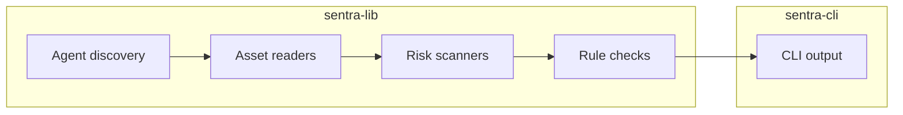

# Architecture

Sentra CLI is split into a command-line layer and a reusable Rust library.

## Flow

1. `sentra-cli` parses the command and resolves scan options.
2. `sentra-lib` discovers supported Agent installations and reads assets such as skills, providers, memory, and cron entries.
3. Risk scanners normalize assets and run local checks.
4. Rule checks evaluate YARA, hash, local TI, optional online TI, and optional LLM checks.
5. The CLI renders human-readable or JSON output.

## Boundaries

- `sentra-cli` owns terminal interaction, output formatting, config commands, and bundled rule import.
- `sentra-lib` owns discovery, asset modeling, rule loading, and risk evaluation.
- Bundled rules live under `rules/` and are packaged during the CLI build.
